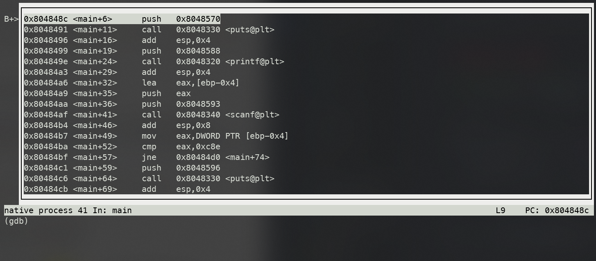
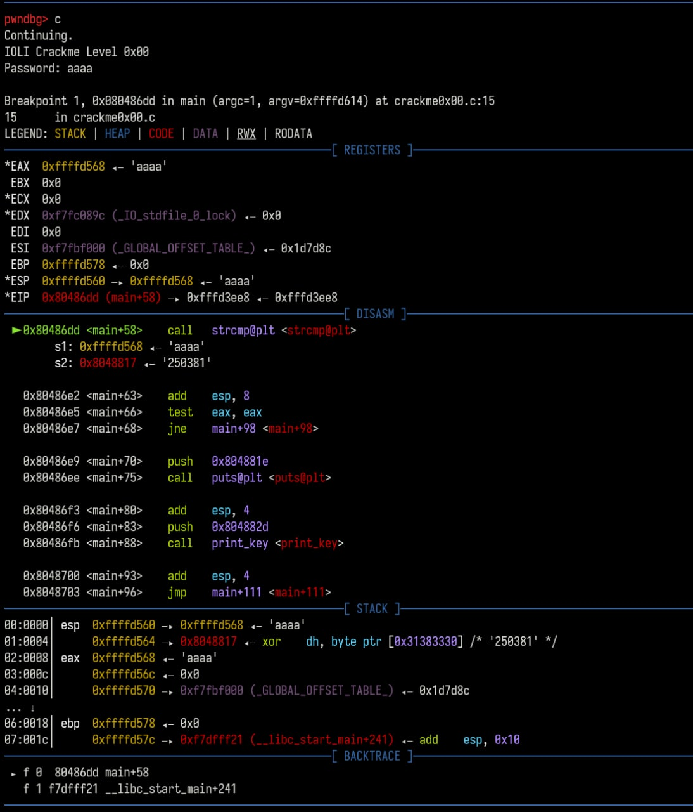

# GDB 逆向调试

## 启动

可以直接控制台输入 `gdb` 并在 GDB 中指定程序（例为 `crackme`）

```bash
$ gdb
(gdb)
GNU gdb (Ubuntu 8.1.1-0ubuntu1) 8.1.1
Copyright (C) 2018 Free Software Foundation, Inc.
License GPLv3+: GNU GPL version 3 or later <http://gnu.org/licenses/gpl.html>
This is free software: you are free to change and redistribute it.
There is NO WARRANTY, to the extent permitted by law.  Type "show copying"
and "show warranty" for details.
This GDB was configured as "x86_64-linux-gnu".
Type "show configuration" for configuration details.
For bug reporting instructions, please see:
<http://www.gnu.org/software/gdb/bugs/>.
Find the GDB manual and other documentation resources online at:
<http://www.gnu.org/software/gdb/documentation/>.
For help, type "help".
Type "apropos word" to search for commands related to "word".
(gdb) file crackme
Reading symbols from crackme0x00...done.
```

或者也可以直接指定程序（假定 `crackme` 在当前目录下）

```bash
$ gdb ./crackme
```

## 运行程序和断点

### 运行程序

指定程序后并不会直接运行，需要使用 `run` 或者缩写 `r`

```bash
(gdb) r
```

需要传参的话可以在 `run` 之前 `set args`

```bash
(gdb) set args inputfile.txt
(gdb) r
```

或者直接 `r args`

```bash
(gdb) r inputfile.txt
```

### 断点

在程序运行前和运行中可以用 `break` 或 `b` 指定断点（breakpoint），可以使用函数名，行号（逆向的话通常不知道）和指令地址

使用函数名断点

```bash
(gdb) b main
```

使用行号断点

```bash
(gdb) b 9
```

使用指令地址断点（根据汇编），注意因为是地址所以要用 `b *address` 格式

譬如在汇编中注意到有 `strcmp` 函数调用

```diff
(gdb) disas
Dump of assembler code for function main:
    0x080486a3 <+0>:     push   ebp
    ...
    0x080486d1 <+46>:    add    esp,0x8
    0x080486d4 <+49>:    push   0x8048817
    0x080486d9 <+54>:    lea    eax,[ebp-0x10]
    0x080486dc <+57>:    push   eax
+   0x080486dd <+58>:    call   0x8048420 <strcmp@plt>
    0x080486e2 <+63>:    add    esp,0x8
   ...
```

在 `call strcmp` 处断点

```bash
(gdb) b *0x080486dd
Breakpoint 2 at 0x80486dd: file crackme.c, line 15.
```

或者也可以用相对 `main` 的偏移（offset）来断点

```bash
(gdb) b *main+58
```

程序运行到断点时会停止。这时可以查看汇编、寄存器值等操作

```bash
(gdb) r
Starting program: /path/to/crackme
Breakpoint 1, main (argc=1, argv=0xffffd6c4) at crackme.c:9
```

## 查看汇编、寄存器值、变量值

### 汇编

`disassemble` 或 `disas` 可以查看 *当前* 栈帧（frame）的汇编。比如刚才在 `main` 处打了断点，就能够查看 `main` 的汇编。

```bash
(gdb) disas
Dump of assembler code for function main:
   0x08048486 <+0>:     push   ebp
   0x08048487 <+1>:     mov    ebp,esp
   0x08048489 <+3>:     sub    esp,0x4
   ...
```

汇编格式默认是 AT&T, 不想看 AT&T 的阴间汇编的话要提前设置 assembly flavor

```bash
(gdb) set disassembly-flavor intel
```

带上 `/m` 参数可以把源码和汇编一起排列（如果有源码的话），没有也能显示一组汇编对应的 c 程序行号，打断点更方便一些。

```bash
(gdb) disas /m
Dump of assembler code for function main:
7       in crackme.c
   0x08048486 <+0>:     push   ebp
   0x08048487 <+1>:     mov    ebp,esp
   0x08048489 <+3>:     sub    esp,0x4
   ...
```

### 寄存器

可以使用 `info register` 或缩写 `i r` 查看寄存器值

```bash
(gdb) i r
eax            0xf7fbcdd8       -134492712
ecx            0xfcf63fa0       -50970720
edx            0xffffd654       -10668
ebx            0x0      0
esp            0xffffd624       0xffffd624
ebp            0xffffd628       0xffffd628
esi            0xf7fbb000       -134500352
edi            0x0      0
eip            0x804848c        0x804848c <main+6>
eflags         0x286    [ PF SF IF ]
cs             0x23     35
ss             0x2b     43
ds             0x2b     43
es             0x2b     43
fs             0x0      0
gs             0x63     99
```

### 变量

如果你知道变量名，可以用 `print var` 或 `p var` 打印其内容，也可以打印寄存器内容

比如打印 `argv[0]` （程序名）

```bash
(gdb) p argv[0]
$1 = 0xffffd7f4 "/path/to/crackme"
```

注意到 `print` 有一个自增 id，我们可以通过 `print $id` 来打印之前打印过的值

```bash
(gdb) p $1
$2 = 0xffffd7f4 "/path/to/crackme"
```

`x address` 可以用来检视内存内容，比如 `x $eax` 会把 `%eax` 中存储的值解读为内存地址，并打印其内容

`p` 和 `x` 可以用基本相同的一套格式化方法来指定要打印变量 / 内存地址被解读为何种类型

- `/o`：8 进制（octal）
- `/x`：16 进制 （hexadecimal）
- `/u`：无符号 10 进制（unsigned decimal）
- `/t`：binary
- `/f`：floating point
- `/a`：address —— 这不还是 16 进制吗 =、=
- `/c`：char
- `/s`：string

`x` 还可以用 `/i` 采用指令（instruction）格式化方法

`x` 还能指定字符串的字符宽度（譬如 UTF-16le 或 UTF-8 字符宽度就可能为 2 或 3 个字节）

- `b`: byte
- `h`: halfword (16-bit value)
- `w`: word (32-bit value)
- `l`: giant word (64-bit value)

来看看打印效果

```bash
(gdb) x/bs 0x8048817
0x8048817:      "250381"
(gdb) x/ws 0x8048817
0x8048817:      U"\x33303532\x50003138\x77737361\x2064726f\x3a204b4f\x616c0029\x3a313062\x6f747574\x6c616972\x766e4900\x64696c61\x73615020\x726f7773Ⅴ\x31b0100䀻܀\xfffbc000烿\xfffc8000铿\xfffcd000峿\xfffda600\xa8ff\xfffe5300죿\xfffed000\xffff3000\x134ff᐀"
(gdb) x/hs 0x8048817
0x8048817:      u"㔲㌰ㄸ倀獡睳牯⁤䭏㨠)慬ぢ㨱畴潴楲污䤀癮污摩倠獡睳牯Ⅴ"
(gdb) x/ls 0x8048817
0x8048817:      "250381"
```

### 其他

如果想边看汇编边调试的话，可以用 `layout asm` 显示汇编和命令行

```bash
(gdb) layout asm
```

效果如图



想要退出 `layout` 模式只需 `Ctrl` + `X, A` （按住 `Ctrl` + `X` 后再按 `A`，类似 VSCode 的 `Ctrl + K, *` 系列操作）

`layout` 除了显示汇编，还可以显示其他内容。具体参数如下：

- `src`   : Displays source and command windows.
- `asm`   : Displays disassembly and command windows.
- `split` : Displays source, disassembly and command windows.
- `regs`  : Displays register window. If existing layout

## 按步调试

`continue` 或缩写 `c` 可以让程序运行到下一个断点

`next` 或 `n` 可以让程序运行到 *当前栈帧* 的下一条语句。在遇到函数调用时，`next` **不会**跟踪进入函数。

`step` 或 `s` 可以让程序运行到下一条语句。在遇到函数调用的时候，`step` **会**跟踪进入函数。

`nexti` 和 `stepi` 与不带 `i` 的指令类似，区别是他们会让程序运行到下一条汇编指令（`i` 指 instruction）

## Tips

觉得在 GDB 里看汇编太累的话可以 `objdump` 整个文件，在喜欢的编辑器里带着高亮慢慢看。 Sublime Text 3 推荐 NASM x86 Assembly 这个高亮

```bash
objdump -M intel
```

使用 `pwndbg` 这个 GDB 插件可以把工作量（指记住 GDB 命令）减少很多。在每次运行到断点时 `pwndbg` 都会把可能需要的信息漂亮地打出来


