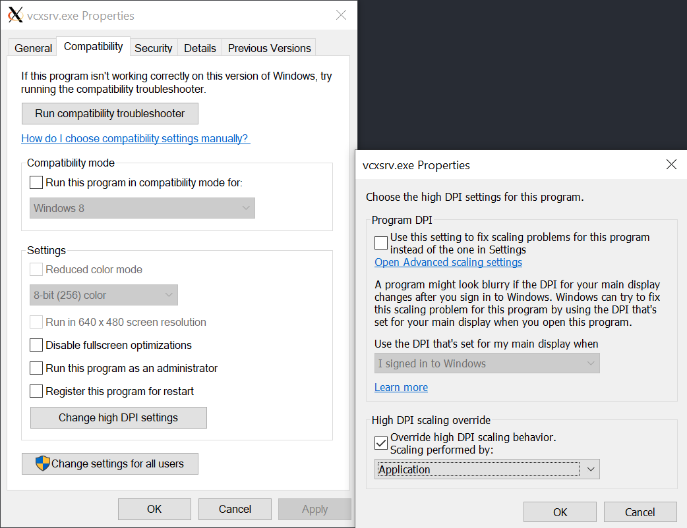

# 在 Windows 10 上装 X

## X Window System 简介

TBC


## 基本配置

### Windows 设置：安装 Xserver

其实安装个 Xserver 挺简单的。

Windows 上的 Xserver 有好几个选择，我用的是 [VcXsrv](https://sourceforge.net/projects/vcxsrv/)。如果你用 [choco](https://chocolatey.org/)，还能更方便，可以直接 `choco install vcxsrv`。 可爱强强又富有的[狗哥](https://github.com/FluorineDog)推荐了微软应用商店的 [X410](https://x410.dev/)，看起来和 Windows 10 整合得很优秀，不过真的好贵啊……

然后是 HiDPI 设置，一般通过轻薄本现在应该都至少是 2K 或 3K 屏幕了。不设置一下的话字体会糊。

首先找到软件的安装路径，比如 `C:\Program Files\VcXsrv`，然后对两个可执行文件 vcxsrv.exe 和 xlaunch.exe 执行以下操作：

1. 右键点击可执行文件
2. 进入 `Properties -> Compatibility -> Change high DPI settings -> High DPI scaling override`
3. 选中 `Override high DPI scaling behavior`
4. 将 Scaling performed by 选项设为 Application



在开始菜单查找 XLaunch 并运行，一路默认就可以开启 Xserver。如果是 WSL2，记得还要关闭 access control。用命令行的话就是添加 `-ac` 选项。

### WSL 设置

首先设置 `DISPLAY` 环境变量。 WSL1 可以 `export DISPLAY=localhost:0.0` ， WSL2 就要指定 IP 了。 可以这样一劳永逸：

```bash
export DISPLAY=$(awk '/nameserver / {print $2; exit}' /etc/resolv.conf 2>/dev/null):0
```

这里也设置了一下 `LIBGL_ALWAYS_INDIRECT`，虽然窝目前好像也没什么 3D rendering 需要……

```bash
export LIBGL_ALWAYS_INDIRECT=1
```

然后是 WSL 方面的 HiDPI 显示设置，当然是有多种解决方案的。参考 [Arch Linux wiki 有关 HiDPI 的页面](https://wiki.archlinux.org/index.php/HiDPI) （写得超级棒！），感觉设置 GTK（GDK）的环境变量是最泛用的。

我的方案：

```bash
export GDK_SCALE=1
export GDK_DPI_SCALE=1.5
```

这个数值在小新 Pro 13 的 2K 屏幕上对于大多数应用效果都不错。不过 JB 家的 IntelliJ IDEA 和 CLion 因为是 Swing 应用， UI scale 只支援整数倍，1.5 似乎相当于 scale 到 2 了，导致字都看起来非常大……不过可以通过调整字体大小解决。

这个表格大致整理了应该修改哪些地方（基于 CLion 2020 的菜单层级）：

| 设置项 | 作用 |
| --- | --- |
| `Appearance & Behavior > Appearance > Use Custom Font` | 设置绝大多数 UI 字体 |
| `Editor > Font` 或 <br> `Editor > Color Scheme > Color Scheme Font` | 设置编辑器（写代码的区域）的字体|
| `Editor > Color Scheme > Console Font` | 设置内建终端（Integrated Terminal）的字体 |

### 大功告成！

设置好 `DISPLAY` 和 HiDPI 支援并开启 Xserver 之后就能运行 GUI 应用了。

可以拿 `xeyes` 测试一下：

```bash
sudo apt install x11-apps
xeyes
```

不出意外你就能看到熟悉的弱智小眼球了。

也能正常使用安装在 WSL 的 Sublime Text、CLion、IntelliJ IDEA 等等。

## JetBrains IDE 的进一步调整

装了 JB 家的几个 IDE 之后发现没法即开即用，还要再配置点东西。

### Use Windows default browser

WSL 没有默认浏览器（当然），而 JB 家 IDE 的 markdown 渲染器依赖 JCEF，所以必须得有个浏览器。我们可以用 Windows 的浏览器：

打开 `Settings > Tools > Web Browsers`，将 `Default Browser` 的路径改为 `/mnt/c/path/to/your/browser/browser.exe` 即可。

### Resolve JCEF dependency issue

JCEF 依赖的 `libcef.so` 和 `libjcef.so` 两个库都有一大堆依赖。根据 event log 的报错安装一下就好了。我缺 `libXss` 和 `libgbm`：

```bash
$ sudo apt install libxss1 libgbm1
```

## 使用中文输入法

应该可以装 `fcitx` 或者 `ibus` 来使用中文输入法。不过目前没有输入中文需求。暂时搁置。

## Reference

1. [鸟哥的 Linux 私房菜：第二十三章、X Window 设定介绍](https://linux.vbird.org/linux_basic/centos7/0590xwindow.php)
2. [Lainme's Blog：如何优雅的在 Linux 上装 X](https://www.lainme.com/doku.php/blog/2018/07/%E5%A6%82%E4%BD%95%E4%BC%98%E9%9B%85%E7%9A%84%E5%9C%A8windows_10%E4%B8%8A%E8%A3%85x)
