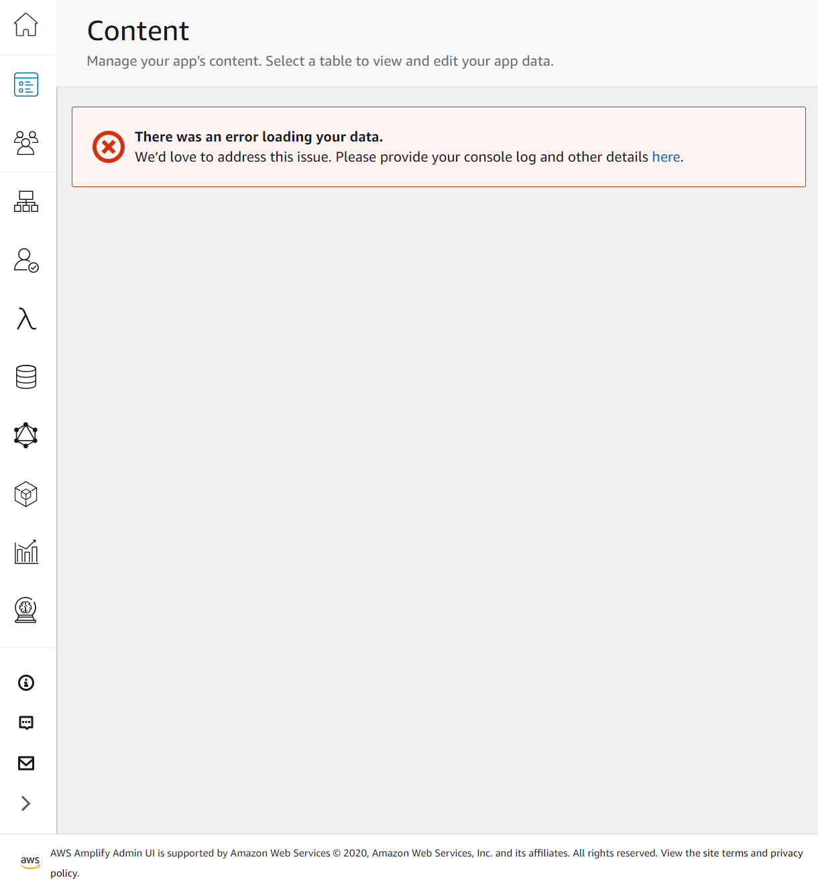
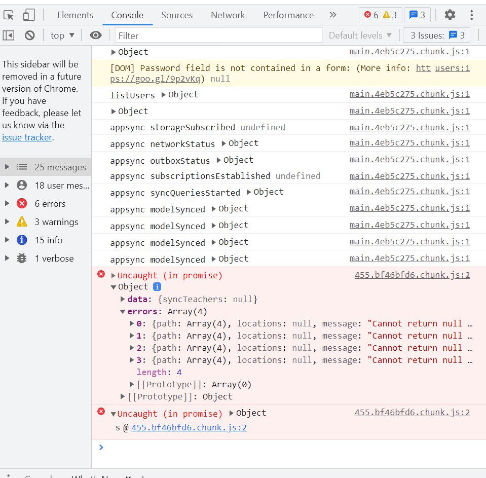

# AWS Amplify 踩坑记录🕳

我也不知道这算不算 DevOps

## 试图从 staging clone 出一个配置一样的 dev 环境

### 被坑过程

Amplify backend 已有 staging，想直接再 Amplify Console clone 失败了， 出来一份空的 :/

在本地有 staging backend 配置表的分支 development 上拉取 dev environment:

```shell
amplify pull --appId <appId> --envName dev
```

之后进行 push，提示 `HostedUIProvidersCustomResourceInputs` update 失败。

```shell
Embedded stack arn:aws:cloudformation:<myapp> was not successfully updated. Currently in UPDATE_ROLLBACK_IN_PROGRESS with reason: The following resource(s) failed to update: [HostedUIProvidersCustomResourceInputs].
```

谷歌到 [这个 issue](https://github.com/aws-amplify/amplify-cli/issues/3798)，提示可能是 `tream-provider-info.json` 里缺 `auth` 内容。看了一下果然是空的。

在 JSON 里添加 `auth` 相关字段。

```json
{
  ...
  "categories": {
      "auth": {
        "<appName>": {
          "userPoolId": "...",
          "userPoolName": "...",
          "webClientId": "...",
          "nativeClientId": "..."
        }
      }
    }
}
```

再次 `amplify push`， 提示 `[webClientId, nativeClientId, userPooId] does not exist in the template`。

```shell
UPDATE_FAILED auth<appName> AWS::CloudFormation::Stack <TIME> Parameters: [webClientId, nativeClientId, userPoolId] do not exist in the template
```

重新阅读上面提到的 issue，在对话里翻出 [这么一条](https://github.com/aws-amplify/amplify-cli/issues/3798#issuecomment-852150899)：原因是切换环境之后 `$HOME` directory 下 `.aws` 的 global settings 中 Amplify 的 deployment-secrets.json 没有正确 fetch 到。这又是 `@aws-amplify/cli` 更新到新版本之后的改动……

哎。无语了。

在 `$HOME/.aws/amplify/deployment-secrets.json` 中把对应社交平台的 `[ProvidersCustomResourceInputs]` 的 `clientID` 和 `clientSecrets` 填好（哪怕是 dummy ID & secrets 也行得通，只要不是空的），就能正常 deploy 了。

总结：

1. 真的不要随便升级 amplify cli
2. 创建 resource 一定要在本地，改动则不要在本地，要在 web console……

## Debug Amplify admin UI

If you ever encounter any error in your Amplify Admin UI, it's useful to open the debug view in your browser and checkout the console.



In Chrome just press `F12`. There will be some usefull messages concerning what is wrong when Amplify tried to send request to the components in your app.



Here I have some Uncaught error in one of the items in my DynamoDB...
